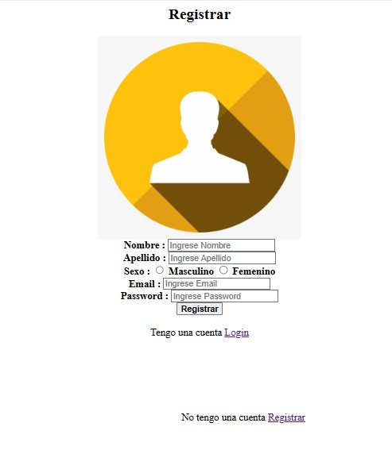
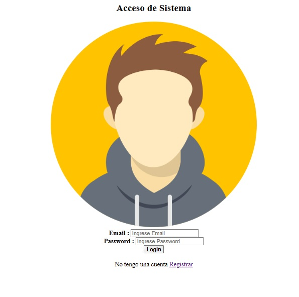

## Acceso al Sistema Web

Esta Web es creado para el ingreso de contactos y registro nuevos y se creo  con la tecnología de **Python** with **Django** y su propia base de datos en **Mysql** para dar estilo en la página se utilizo **Bootstrap 5**

# Paso a Seguir:

- primero se utiliza los comando:"*django-admin startproject WebAccesoSistema*"
- como segundo comando:"*django-admin startapp login*"
- como tercero comando: "*django-admin startapp signup*"
 
- comando 4: *py manage.py runserver*

## install:
- comando para conectar el **MYSQL** con **PYTHON**: pip install mysql-connector-python.
# Image:
- Login:

- Acceso:

## Funcionamiento de mi aplicación 

- [Sistema de Acceso](https://www.youtube.com/watch?v=gMkfiNhRKkU)este es la página que se ve como funciona mi PROYECTO 